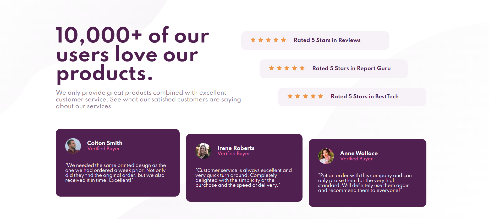

# Frontend Mentor - Social proof section solution 👋🏾👋🏾

This is a solution to the [Social proof section challenge on Frontend Mentor](https://www.frontendmentor.io/challenges/social-proof-section-6e0qTv_bA). Frontend Mentor challenges help you improve your coding skills by building realistic projects. 

## Table of contents

- [Overview](#overview)
  - [The challenge](#the-challenge)
  - [Screenshot](#screenshot)
  - [Links](#links)
- [My process](#my-process)
  - [Built with](#built-with)
  - [What I learned](#what-i-learned)
  - [Continued development](#continued-development)
  - [Useful resources](#useful-resources)

## Overview

### The challenge

Users should be able to:

- View the optimal layout for the section depending on their device's screen size

### Screenshot

### Links

- [Solution (Github)](https://github.com/joy-joy2001/social-proof-section-master.git)
- [Social Proof Section by Joy E](https://joy-joy2001.github.io/social-proof-section-master/)

## My process

### Built with

- Semantic HTML5 markup
- CSS custom properties - Became familiar with customer properties thru freeCodeCamp and its actually not as hard as I though!
- Flexbox - Becoming more comfortable with flexbox and putting in the effort to debug myself and read documentation rather than just copying solutions online without fully understanding

**NEXT UP ON MY LEARNING: CSS GRID + MOBILE FIRST WORKFLOW/RESPONSIVE + SASS**

### What I learned

I learnt more about flexbox and its properties i.e. flex which consists of flex-grow, flex-shrink and flex-basis. I think I have a somewhat good understanding of how they work individually. I challenged myself to read a long-ass article to understand how it works and now I do! Doing so helped me to format the hero section in a way that the flex-item will occupy the same amount of space (50%)

Additionally, using the custom css properties made adding colour properties much easier! I can see why everyone use it now...

### Continued development

I think I need to start facing my fears and attempt responsive design i.e. media queries and mobile first flow... I'm gonna redo this project and the 3 card column using a mobile first workflow and make it as repsonsive as possible!

### Useful resources

- [Equal Column layouts with Flexbox](https://css-tricks.com/equal-columns-with-flexbox-its-more-complicated-than-you-might-think/) - This helped me with the hero section where I wanted to make the columns of equal size, DESPITE having different content size!

